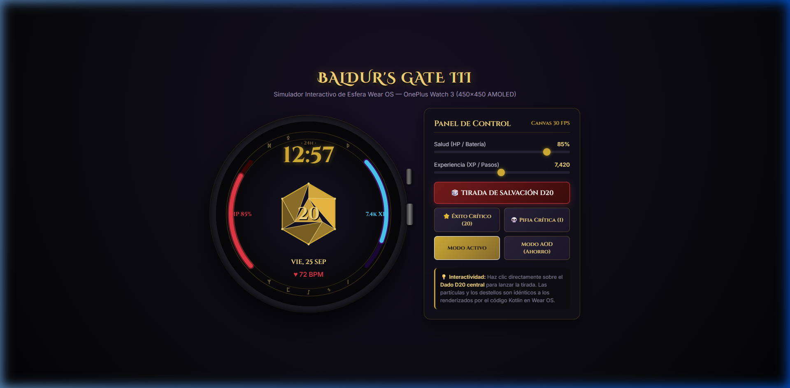
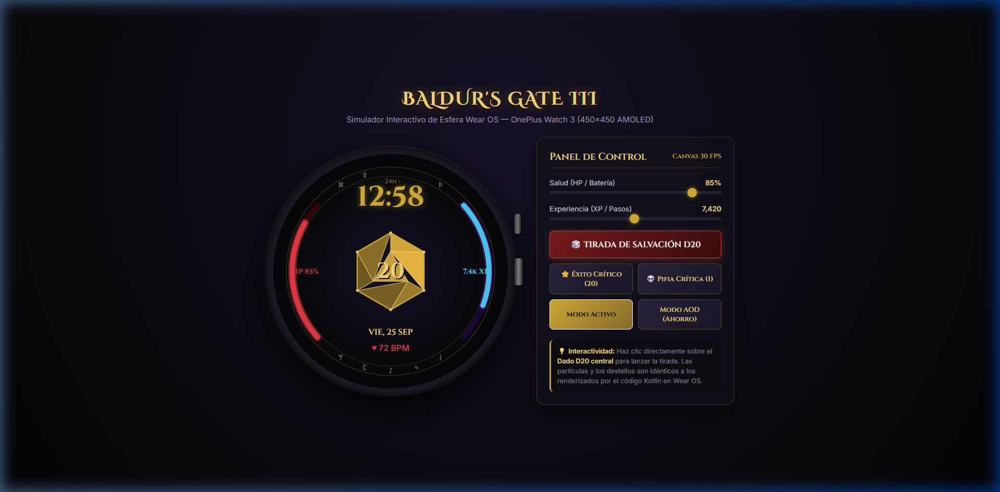
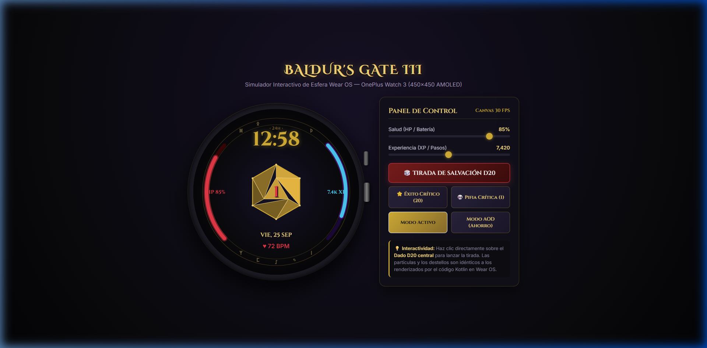
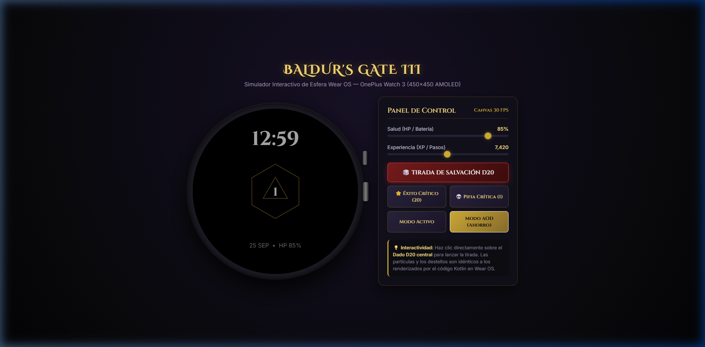

# 🎲 Baldur's Gate 3 — Esfera de Reloj Interactiva para Wear OS
### Optimizada para OnePlus Watch 3 (Wear OS 4 / 5, API 33+)

Esfera de reloj interactiva, animada y de alta fidelidad inspirada en el universo y la interfaz de **Baldur's Gate 3 (BG3)**. Diseñada específicamente para pantallas circulares AMOLED (450×450 y 466×466 píxeles), desarrollada en **Kotlin** utilizando la arquitectura oficial de Jetpack **`androidx.wear.watchface`** con un **`CanvasRenderer`** acelerado por hardware a 30 FPS.

---

## 📸 Demostración Visual

| Modo Activo (30 FPS) | Éxito Crítico (Nat 20) | Pifia Crítica (Nat 1) | Always-On Display (AOD) |
| :---: | :---: | :---: | :---: |
|  |  |  |  |

---

## ⚔️ Características Principales

### 1. Dado de 20 Caras Central (D20 Interactivo)
- **Geometría de Icosaedro 2D con Sombreado 3D**: Proyección de 10 facetas poligonales visibles con cálculo de iluminación angular (luz direccional superior izquierda) simulando acabado en bronce y oro envejecido.
- **Tirada de Salvación al Tocar (Tap Action)**:
  - Al pulsar el D20, se activa una vibración háptica rítmica simulando el traqueteo de los dados.
  - El dado vibra con temblor físico atenuado (`shakeOffsetX`, `shakeOffsetY`) y rotación dinámica mientras baraja rápidamente números entre 1 y 20 con desaceleración física gradual (1300 ms).
  - **Éxito Crítico (Natural 20)**: Halo dorado radiante, explosión de 50+ partículas/destellos dorados (`ParticleSystem`) y patrón háptico triple triunfal con estandarte «¡ÉXITO CRÍTICO!».
  - **Pifia Crítica (Natural 1)**: Nube de humo etéreo necrótico carmesí/púrpura con dispersión ascendente, temblor prolongado y estandarte «¡PIFIA CRÍTICA!».
  - **Tiradas Estándar (2 a 19)**: Asentamiento limpio con clic táctil háptico.
- **Pulsación Arcana en Reposo (Breathing Glow)**: Modulación sinusoidal suave ($\sim 0.4$ Hz) en el aura dorada del D20 y en las runas exteriores.

### 2. Indicador de Salud (HP) — Arco Izquierdo
- Representa el **Nivel de Batería** del reloj (0% a 100%).
- Gradiente en rojo rubí carmesí (`#E63946` / `#8B0000`) con riel oscuro (`#380505`) y halo de resplandor.
- Etiqueta «HP» y porcentaje en tiempo real.

### 3. Indicador de Experiencia (XP) — Arco Derecho
- Representa el **Progreso de Pasos Diarios** hacia la meta (por defecto 10.000 pasos).
- Gradiente en azul zafiro arcano y violeta ilícido (`#4CC9F0` / `#7209B7`).
- Etiqueta de pasos formateados (ej. «7.4k XP»).

### 4. Cronómetro Digital 24H y Complicaciones
- **Parte Superior**: Hora digital estilizada en formato 24h (`HH:mm`) con tipografía gótica medieval, relieve sombreado y distintivo `‹ 24h ›`.
- **Parte Inferior**: Fecha completa (`VIE, 25 SEP`) y ranura de frecuencia cardíaca con pulso de sangre (`♥ 72 BPM`).

### 5. Modo Always-On Display (AOD / Ambient Mode)
- **Protección contra quemaduras de pantalla (Burn-in Protection)** y ahorro extremo de batería.
- Fondo negro absoluto AMOLED (`#000000`).
- Oculta fondos pesados, partículas y animaciones.
- Dibuja el contorno lineal del D20 en oro apagado (`#554522`) y la hora en gris tenue (`#AAAAAA`).
- **Ratio de píxeles activos (OPR) < 6%**, cumpliendo con la estricta normativa de consumo de Wear OS.

---

## 📁 Estructura del Proyecto

```
WearOS/
├── build.gradle.kts                # Configuración de compilación raíz
├── settings.gradle.kts             # Repositorios y módulos
├── gradle.properties               # Configuración de memoria JVM y AndroidX
├── gradle/
│   ├── libs.versions.toml          # Catálogo de versiones Gradle (AGP 8.4, Wear Watchface 1.2.1)
│   └── wrapper/                    # Gradle Wrapper 8.7
├── app/
│   ├── build.gradle.kts            # Configuración Wear OS (Target SDK 34, Min SDK 30)
│   ├── proguard-rules.pro          # Reglas de ofuscación y optimización
│   └── src/main/
│       ├── AndroidManifest.xml     # Declaración del servicio WatchFaceService y permisos
│       ├── res/
│       │   ├── values/             # strings.xml, colors.xml, styles.xml
│       │   ├── xml/watch_face.xml  # Descriptor de WallpaperService
│       │   ├── drawable/           # Iconos vectoriales adaptativos
│       │   └── drawable-nodpi/     # Previews oficiales para la app Companion y selector
│       └── java/com/bg3/watchface/
│           ├── BG3WatchFaceService.kt      # Servicio principal de la esfera
│           ├── renderer/
│           │   ├── BG3CanvasRenderer.kt    # Renderizado 2D en Canvas, AOD y cálculo de arcos
│           │   ├── BG3Theme.kt             # Paletas, fuentes góticas y PaintCache sin asignación de memoria
│           │   └── D20Geometry.kt          # Proyección matemática del icosaedro y sombreado 3D
│           ├── controller/
│           │   ├── D20RollController.kt    # Máquina de estados de la tirada, física y háptica
│           │   └── ParticleSystem.kt       # Gestor de partículas con pooling (zero-allocation)
│           ├── model/
│           │   ├── RollState.kt            # Estados (Idle, Rolling, CriticalSuccess, CriticalFail, Settled)
│           │   └── Particle.kt             # Modelo y física de partículas
│           └── sensor/
│               ├── BatteryMonitor.kt       # Receptor de batería para la barra de HP
│               └── StepSensorManager.kt    # Sensor de pasos para la barra de XP
└── preview/
    └── index.html                  # Simulador interactivo en HTML5 Canvas
```

---

## ⚡ Guía de Compilación e Instalación Inalámbrica (ADB por Wi-Fi)

### Requisitos Previos
1. **Java 17 o 21** instalado en el PC.
2. **Android SDK** con `platform-tools` (comando `adb`).
3. El reloj **OnePlus Watch 3** y tu PC deben estar conectados a la **misma red Wi-Fi**.

---

### Paso 1: Activar Depuración Inalámbrica en el OnePlus Watch 3
1. En el reloj, abre **Ajustes > Sistema > Información del reloj > Versiones**.
2. Pulsa rápidamente **7 veces consecutivas** sobre **Número de compilación** hasta que aparezca el aviso: *«¡Ya eres desarrollador!»*.
3. Vuelve a **Ajustes > Opciones de desarrollador**.
4. Activa **Depuración ADB**.
5. Activa **Depuración inalámbrica** (Wireless debugging).

---

### Paso 2: Vincular y Conectar el Reloj vía ADB
1. Dentro de **Ajustes > Opciones de desarrollador > Depuración inalámbrica**, pulsa en **Vincular nuevo dispositivo**.
   - El reloj mostrará una IP y puerto de emparejamiento (ej. `192.168.1.145:37123`) y un código de 6 dígitos (ej. `482910`).
2. Abre PowerShell o tu terminal en el PC y ejecuta:
   ```powershell
   adb pair 192.168.1.145:37123
   ```
   Introduce el código de vinculación cuando te lo pida.
3. Regresa a la pantalla principal de **Depuración inalámbrica** en el reloj y anota el puerto de conexión (ej. `192.168.1.145:41255`).
4. Conéctate con:
   ```powershell
   adb connect 192.168.1.145:41255
   adb devices
   ```
   Verás el dispositivo listado como:
   `192.168.1.145:41255    device`

---

### Paso 3: Compilar el APK con Gradle
En la raíz del proyecto (`WearOS/`):
```powershell
# Compilar el APK en modo Debug
.\gradlew.bat assembleDebug
```
El APK se generará en:
`app\build\outputs\apk\debug\app-debug.apk`

---

### Paso 4: Instalar en el OnePlus Watch 3
Ejecuta:
```powershell
adb -s 192.168.1.145:41255 install -r app\build\outputs\apk\debug\app-debug.apk
```

---

### Paso 5: Activar la Esfera en el Reloj
- **Desde el reloj**: Mantén pulsada la pantalla de la esfera actual, desliza a la derecha hasta el botón «+» y selecciona **«Baldur's Gate 3 D20 Watch Face»**.
- **Desde terminal**:
  ```powershell
  adb shell am broadcast -a android.intent.action.SET_WALLPAPER -c com.google.android.wearable.watchface.category.WATCH_FACE
  ```

---

## 🎮 Probar en el Simulador Web
Para probar instantáneamente las animaciones y la física de la esfera sin necesidad de tener el reloj encendido:
1. Inicia un servidor web local:
   ```bash
   python -m http.server 8092 --directory preview
   ```
2. Abre `http://localhost:8092/` en tu navegador.
3. Haz clic sobre el D20 central para lanzar tiradas, prueba los éxitos/pifias críticas y cambia entre el modo activo y el modo AOD.
