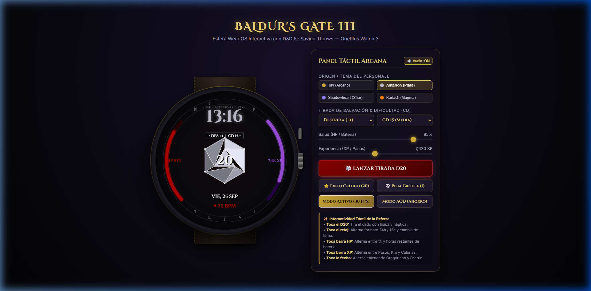
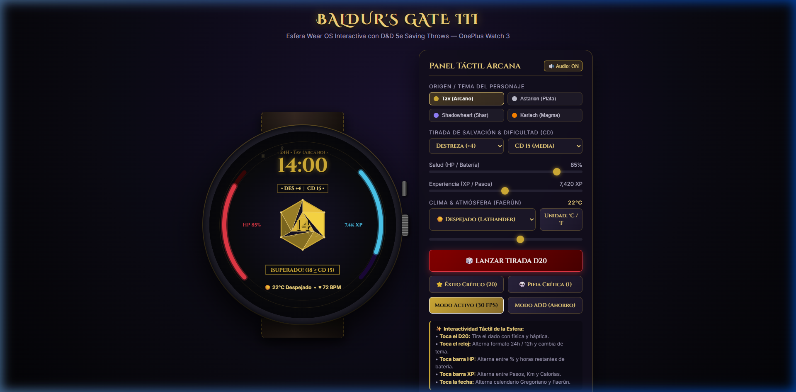

# 🎲 Baldur's Gate 3 — Esfera de Reloj Interactiva para Wear OS
### Optimizada para OnePlus Watch 3 (Wear OS 4 / 5, API 33+)

Esfera de reloj interactiva, animada y de alta fidelidad inspirada en el universo y la interfaz de **Baldur's Gate 3 (BG3)**. Diseñada específicamente para pantallas circulares AMOLED (450×450 y 466×466 píxeles), desarrollada en **Kotlin** utilizando la arquitectura oficial de Jetpack **`androidx.wear.watchface`** con un **`CanvasRenderer`** acelerado por hardware a 30 FPS.

---

## 📸 Galería y Demostración Visual

| Tav (Clásico Arcano) | Astarion (Plata Lunar) | Tirada & Resolución CD | Modo AOD (Ahorro < 6%) |
| :---: | :---: | :---: | :---: |
|  |  |  |  |

---

## ⚔️ Nuevas Mejoras de Experiencia de Usuario (UX Avanzada)

### 1. Sistema Dinámico de Tiradas de Salvación (D&D 5e / BG3 Mechanics)
- **Dificultad de Clase (DC / CD)**: Establece un objetivo de dificultad interactivo (**CD 10, CD 15, CD 18 o CD 20**).
- **Modificadores de Habilidad**: Cambia entre las 6 características clásicas:
  - **Fuerza (FUE +3)**
  - **Destreza (DES +4)**
  - **Constitución (CON +2)**
  - **Inteligencia (INT +1)**
  - **Sabiduría (SAB +2)**
  - **Carisma (CAR +3)**
- **Resolución en Vivo**:
  - Al tirar el D20, el sistema suma tu modificador a la tirada y lo compara contra la CD objetivo.
  - **Éxito Crítico (Nat 20)**: Destello solar dorado, 55 partículas y estandarte «¡ÉXITO CRÍTICO (20)!».
  - **Pifia Crítica (Nat 1)**: Nube de humo necrótico ascendente y estandarte «¡PIFIA CRÍTICA (1)!».
  - **Tirada Superada**: Estandarte de victoria verde/dorado: *«¡SUPERADO! (Total: 21 ≥ CD 15)»*.
  - **Tirada Fallada**: Estandarte de derrota carmesí: *«¡FALLADO! (Total: 11 < CD 15)»*.

### 2. 4 Temas de Compañeros de Origen (Paletas Dinámicas)
1. **Tav (Clásico Arcano)**: Oro bruñido (#D4AF37), rubí sangre (#E63946) y vacío estelar (#151224).
2. **Astarion (Pícaro Vampírico)**: Plata lunar (#C0C0D0), púrpura sombrío (#9D4EDD) y carmesí coagulado (#B30000).
3. **Shadowheart (Clériga de Shar)**: Ocaso crepuscular (#9381FF), cian de engaño (#00F5D4) y noche abisal.
4. **Karlach (Corazón Infernal)**: Bronce forjado (#FF8500), magma ardiente (#D90429) y ascuas de motor infernal.

### 3. Widget de Información del Tiempo y Atmósfera
- **Temperatura en Tiempo Real**: Visualización en grados Celsius o Fahrenheit (`22°C` / `72°F`).
- **Condiciones y Lore de Faerûn**: Iconos atmosféricos y descripciones inspiradas en los Reinos Olvidados:
  - ☀️ **Despejado** (*Sol de Lathander*)
  - ⛅ **Parcialmente Nublado** (*Vientos de Selûne*)
  - ☁️ **Nublado** (*Brumas de la Costa de la Espada*)
  - 🌧️ **Lluvia** (*Lágrimas de Ilmater*)
  - ⛈️ **Tormenta Arcana** (*Furia de Talos*)
  - ❄️ **Nieve** (*Aliento de Auril*)
  - 🌫️ **Niebla** (*Niebla de la Infraoscuridad*)
- **Integración AOD**: Muestra la temperatura de manera minimalista junto a la fecha y la batería en el modo de pantalla siempre activa.

### 4. Zonas Táctiles Multiacción (Multi-Zone Touch UX)
- **Tocar D20**: Dispara la tirada animada con física de temblor, desaceleración y respuesta háptica.
- **Tocar Insignia de CD**: Alterna la habilidad activa (FUE -> DES -> CON -> INT -> SAB -> CAR).
- **Tocar Reloj Superior**: Alterna formato 24h / 12h y rota el tema de compañero.
- **Tocar Barra Izquierda (HP)**: Alterna entre Porcentaje de Batería (`HP 85%`) y Horas Estimadas Restantes (`18h BAT`).
- **Tocar Barra Derecha (XP)**: Alterna entre Pasos (`7.4k XP`), Distancia (`5.2 km`) y Calorías (`340 kcal`).
- **Tocar Sección Inferior (Izquierda)**: Alterna la unidad de temperatura entre **Celsius (°C)** y **Fahrenheit (°F)**.
- **Tocar Sección Inferior (Derecha)**: Alterna entre el calendario gregoriano (`VIE, 25 SEP`) y el calendario oficial de los Reinos Olvidados / Faerûn (`25 EL DESVANECER`).

### 5. Audio Procedural (Simulador Web)
- Generación de sonido mediante la **Web Audio API** integrada (sin archivos de audio externos pesados):
  - Traqueteo de dados de hueso y metal al rodar.
  - Arpegio triunfal en Do Mayor al sacar Éxito Crítico (20).
  - Acorde discordante de mazmorra al sacar Pifia (1).
  - Clics táctiles de interfaz con botón de encendido/apagado.

---

## 📁 Estructura del Proyecto

```
WearOS/
├── build.gradle.kts                        # Configuración raíz
├── settings.gradle.kts                     # Repositorios y módulos
├── gradle.properties                       # Memoria JVM y AndroidX
├── gradlew.bat                             # Gradle Wrapper
├── gradle/
│   ├── libs.versions.toml                  # Version Catalog (Wear OS 4/5, Watchface 1.2.1)
│   └── wrapper/gradle-wrapper.properties   # Gradle 8.7
├── app/
│   ├── build.gradle.kts                    # Configuración de compilación (Target SDK 34)
│   ├── proguard-rules.pro                  # Reglas ProGuard
│   └── src/main/
│       ├── AndroidManifest.xml             # Permisos de sensores, hápticos y servicio de esfera
│       ├── res/
│       │   ├── values/                     # strings.xml, colors.xml, styles.xml
│       │   ├── xml/watch_face.xml          # Descriptor WallpaperService
│       │   ├── drawable/                   # Iconos vectoriales
│       │   └── drawable-nodpi/             # Previews oficiales HD
│       └── java/com/bg3/watchface/
│           ├── BG3WatchFaceService.kt      # Servicio principal de la esfera
│           ├── renderer/
│           │   ├── BG3CanvasRenderer.kt    # Renderizado Canvas a 30 FPS, zonas táctiles y AOD
│           │   ├── BG3Theme.kt             # Temas de Origen, calendario Faerûn y PaintCache
│           │   └── D20Geometry.kt          # Icosaedro 3D, facetas, filigrana y remaches
│           ├── controller/
│           │   ├── D20RollController.kt    # Motor de tirada D&D 5e, resolución CD y vibración
│           │   └── ParticleSystem.kt       # Partículas pooled (zero-allocation)
│           ├── model/
│           │   ├── RollState.kt            # Estados y resolución de salvación
│           │   └── Particle.kt             # Modelo cinemático de partículas
│           └── sensor/
│               ├── BatteryMonitor.kt       # Sensor de batería para la barra de HP
│               └── StepSensorManager.kt    # Podómetro para la barra de XP
└── preview/
    ├── index.html                          # Simulador interactivo en HTML5 Canvas con Audio
    └── screenshots/                        # Capturas de pantalla de la esfera
```

---

## ⚡ Guía de Compilación e Instalación Inalámbrica (ADB por Wi-Fi)

### Paso 1: Activar Depuración Inalámbrica en el OnePlus Watch 3
1. En el reloj: **Ajustes > Sistema > Información del reloj > Versiones**.
2. Pulsa **7 veces** sobre **Número de compilación** para activar el modo desarrollador.
3. En **Ajustes > Opciones de desarrollador**:
   - Activa **Depuración ADB**.
   - Activa **Depuración inalámbrica** (Wireless debugging).
4. Reloj y PC deben estar en la misma red Wi-Fi.

### Paso 2: Vincular y Conectar el Reloj
```powershell
# Vincular con el puerto de emparejamiento y código de 6 dígitos mostrado en el reloj
adb pair 192.168.1.145:37123

# Conectar con el puerto de conexión estándar de Wireless Debugging
adb connect 192.168.1.145:41255
adb devices
```

### Paso 3: Compilar el APK con Gradle
```powershell
.\gradlew.bat assembleDebug
```
El APK se genera en:
`app\build\outputs\apk\debug\app-debug.apk`

### Paso 4: Instalar en el Reloj
```powershell
adb -s 192.168.1.145:41255 install -r app\build\outputs\apk\debug\app-debug.apk

# Activar inmediatamente como esfera activa
adb -s 192.168.1.145:41255 shell am broadcast -a android.intent.action.SET_WALLPAPER -c com.google.android.wearable.watchface.category.WATCH_FACE
```

---

## 🎮 Probar en el Simulador Web
Para experimentar con las tiradas, el audio y los temas sin encender el reloj:
```bash
python -m http.server 8092 --directory preview
```
Abre `http://localhost:8092/` en tu navegador.
